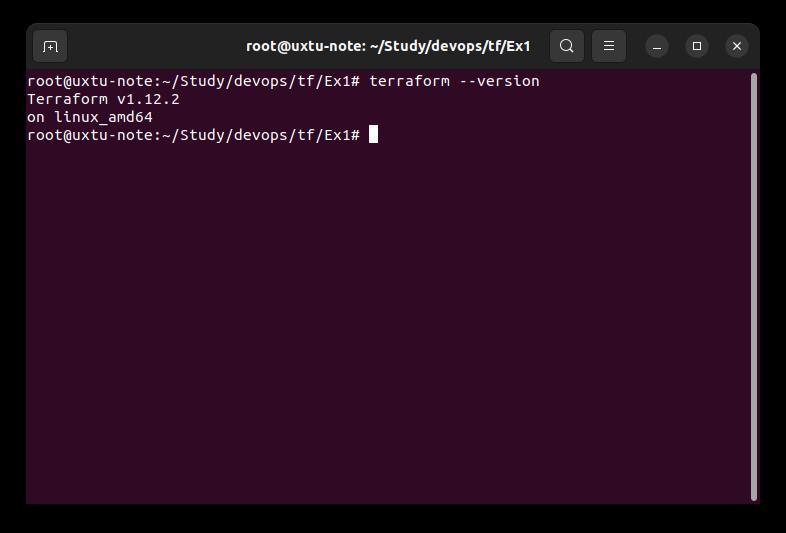

### Task 1 ###  
  
#### 1.2 ####  
Допустимо использовать для хранения секретов по всей видимости personal.auto.tfvars  
#### 1.3 ####  
```
      "type": "random_password",  
      "name": "random_string",  
...  
           "result": "IbfGlmk7Y1hqkSV7",  
```  
#### 1.4 ####  
resource "docker_image" - не имеет имени, а только тип  
resource "docker_container" "1nginx" обращается к ресурсу типа docker_image с именем nginx, который не объявлен, имя ресурса начинается с цифры  
name  = "example_${random_password.random_string_FAKE.resulT}" обращается к ресурсу random_string_FAKE, который не объявлен и к его атрибуту resulT , который на самом деле должен быть result   

#### 1.5 ####  
```
resource "docker_image" "nginx" {  
  name         = "nginx:latest"  
  keep_locally = true  
}  
  
resource "docker_container" "nginx" {  
  image = docker_image.nginx.image_id  
  name  = "example_${random_password.random_string.result}"  

```
```
root@uxtu-note:~/Study/devops/tf/Ex1# docker ps  
CONTAINER ID   IMAGE          COMMAND                  CREATED          STATUS          PORTS                  NAMES  
8e6e9c6c20fe   576306625d79   "/docker-entrypoint.…"   22 minutes ago   Up 22 minutes   0.0.0.0:9090->80/tcp   example_IbfGlmk7Y1hqkSV7  
```  
#### 1.6 ####
```
oot@uxtu-note:~/Study/devops/tf/Ex1# docker ps  
CONTAINER ID   IMAGE          COMMAND                  CREATED         STATUS         PORTS                  NAMES  
ea9635e7baf4   576306625d79   "/docker-entrypoint.…"   6 seconds ago   Up 5 seconds   0.0.0.0:9090->80/tcp   hello_world  
```
```
resource "docker_container" "nginx" {  
  image = docker_image.nginx.image_id  
#  name  = "example_${random_password.random_string.result}"  
  name = "hello_world"  
  
  ports {  
    internal = 80  
    external = 9090  
  }  
```  
Автоматическое приенение конфигурации без предварительного просмотра плана действий может привести к бесконтрольному внесению нежелательных изменений  
Ключ может быть применен в пакетном режиме, если интерактивные действия не предполагаются, а код уже многократно проверен.  
#### 1.7 ####  
```
root@uxtu-note:~/Study/devops/tf/Ex1# cat terraform.tfstate
{  
  "version": 4,  
  "terraform_version": "1.12.2",  
  "serial": 10,  
  "lineage": "12ee300b-daf7-fd9c-1d58-351a436b469b",  
  "outputs": {},  
  "resources": [],  
  "check_results": null  
}  
```
#### 1.8 ####  
Образ не был удален так как указана опция провайдера Docker  
keep_locally = true  
```
keep_locally (Boolean) If true, then the Docker image won't be deleted on destroy operation. If this is false, it will delete the image from the docker local storage on destroy operation.   
```

#### 2* ####

```
terraform {  
  required_providers {  
    docker = {  
      source  = "kreuzwerker/docker"  
    }  
  }  
  required_version = "~>1.12.0" /*Многострочный комментарий.  
 Требуемая версия terraform */  
}  
provider "docker" {  
  context = "yaubuntu"  
}  
  
  
resource "random_password" "random_string" {  
  length      = 16  
  special     = false  
  min_upper   = 1  
  min_lower   = 1  
  min_numeric = 1  
}  

resource "random_password" "mysql_root_pass" {  
  length      = 16  
  min_special = 1  
  min_upper   = 1  
  min_lower   = 1  
  min_numeric = 1  
}  
  
resource "random_password" "mysql_user_pass" {  
  length      = 16  
  min_special = 1  
  min_upper   = 1  
  min_lower   = 1  
  min_numeric = 1  
}  
  
  
resource "docker_image" "mysql" {  
  name         = "mysql:8"  
  keep_locally = true  
}  
  
resource "docker_container" "mysql" {  
  image = docker_image.mysql.image_id  
  name  = "mysql_${random_password.random_string.result}"  
  ports {  
    internal = 3306  
    external = 33066  
  }  
  env = [ "MYSQL_ROOT_PASSWORD=${random_password.mysql_root_pass.result}", "MYSQL_DATABASE=wordpress", "MYSQL_USER=wordpress", "MYSQL_PASSWORD=${random_password.mysql_user_pass.result}", "MYSQL_ROOT_HOST='%'" ]  
}  
```  
#### 3* ####
Не удается выполнить код без изменений на tofu из-за того, что провайдеры другие как минимум  
Для доступа к регистри нужна регистрация  
