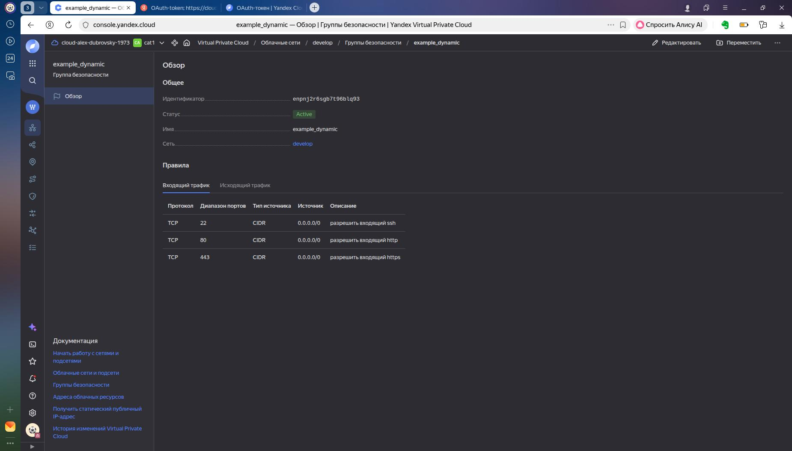
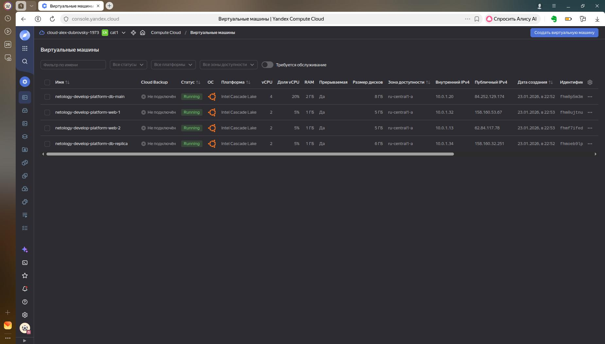

## Task 1 ##  
  

## Task 2 ##  
### 2.1 ###
```  
  count = 2
  name = "netology-develop-platform-web-${count.index+1}"
```  
### 2.2 ###
```  
variable "each_vm" {
  type = list(object({  vm_name=string, cpu=number, ram=number, disk_volume=number, fraction=number }))
  default = [
    {
      vm_name     = "netology-develop-platform-db-main"
      cpu         = 4
      ram         = 2
      disk_volume = 8
      fraction    = 20
    }, 
    {
      vm_name     = "netology-develop-platform-db-replica"
      cpu         = 2
      ram         = 1
      disk_volume = 6
      fraction    = 5
    }
  ]
}
```  
```  
  for_each = {
    for i, vm in var.each_vm:
      i => vm
  }
  name = each.value.vm_name
  platform_id = var.vm_web_platform
  resources {
    cores         = each.value.cpu
    memory        = each.value.ram
    core_fraction = each.value.fraction
  } 
  boot_disk {
    
    initialize_params {
      image_id = data.yandex_compute_image.ubuntu.image_id
      size = each.value.disk_volume
    }
  }
```  
### 2.4 ###
```
resource "yandex_compute_instance" "web" {
  depends_on = [ yandex_compute_instance.db]
```
### 2.5 ###
```
  metadata = {
    serial-port-enable = var.vms_md.serial
    ssh-keys           = "ubuntu:${file("~/.ssh/id_ecdsa.pub")}"
  }
```
### 2.6 ###
```
yandex_vpc_network.develop: Creating...
yandex_vpc_network.develop: Creation complete after 3s [id=enp814qeu8i7n0k7v3ul]
yandex_vpc_subnet.develop: Creating...
yandex_vpc_security_group.example: Creating...
yandex_vpc_subnet.develop: Creation complete after 0s [id=e9b10i0n77nqpq9ltd7h]
yandex_vpc_security_group.example: Creation complete after 2s [id=enpd5jonpa9640nsbkbm]
yandex_compute_instance.db["0"]: Creating...
yandex_compute_instance.db["1"]: Creating...
yandex_compute_instance.db["0"]: Still creating... [00m10s elapsed]
yandex_compute_instance.db["1"]: Still creating... [00m10s elapsed]
yandex_compute_instance.db["0"]: Still creating... [00m20s elapsed]
yandex_compute_instance.db["1"]: Still creating... [00m20s elapsed]
yandex_compute_instance.db["0"]: Still creating... [00m30s elapsed]
yandex_compute_instance.db["1"]: Still creating... [00m30s elapsed]
yandex_compute_instance.db["1"]: Creation complete after 33s [id=fhmoeb9lp7kdhqpg0b6l]
yandex_compute_instance.db["0"]: Still creating... [00m40s elapsed]
yandex_compute_instance.db["0"]: Creation complete after 42s [id=fhm0p5m3m8doeav6hpve]
yandex_compute_instance.web[1]: Creating...
yandex_compute_instance.web[0]: Creating...
yandex_compute_instance.web[1]: Still creating... [00m10s elapsed]
yandex_compute_instance.web[0]: Still creating... [00m10s elapsed]
yandex_compute_instance.web[1]: Still creating... [00m20s elapsed]
yandex_compute_instance.web[0]: Still creating... [00m20s elapsed]
yandex_compute_instance.web[1]: Creation complete after 28s [id=fhmf7ifedc5578efmn9t]
yandex_compute_instance.web[0]: Still creating... [00m30s elapsed]
yandex_compute_instance.web[0]: Creation complete after 33s [id=fhm0ujtnu0nj33abgd58]

Apply complete! Resources: 7 added, 0 changed, 0 destroyed.
```

## Task 3 ##  
### 3.1 ###  
```
resource "yandex_compute_disk" "my_disks" {
  count = 3
  name = var.my_disks[count.index].name
  type = var.my_disks[count.index].type
  size = var.my_disks[count.index].size
  zone = var.default_zone
}
```
### 3.2 ###
```
  dynamic "secondary_disk" {
    for_each = var.my_disks.*.name
    content {
      disk_id     = yandex_compute_disk.my_disks[secondary_disk.key].id
      device_name = yandex_compute_disk.my_disks[secondary_disk.key].name
      auto_delete = true  
    }  
  }
```
```
      + secondary_disk {
          + auto_delete = true
          + device_name = "family"
          + disk_id     = "fhm0nf1duut97kaf49ph"
          + mode        = "READ_WRITE"
        }
      + secondary_disk {
          + auto_delete = true
          + device_name = "hobby"
          + disk_id     = "fhm3baq23vjakpnb31vs"
          + mode        = "READ_WRITE"
        }
      + secondary_disk {
          + auto_delete = true
          + device_name = "work"
          + disk_id     = "fhm50l7bt7gmibf8sl3q"
          + mode        = "READ_WRITE"
        }
```
## Task 4 ##
### 4.1. ###
```
resource "local_file" "hosts_templatefile" {
  content = templatefile( "${path.module}/hosts.tftpl",
    { webservers = yandex_compute_instance.web
      databases  = yandex_compute_instance.db
      storages   = [yandex_compute_instance.storage]
    }
  )

  filename = "${abspath(path.module)}/hosts.ini"
}
```
### 4.2 ###
```
[webservers]

netology-develop-platform-web-1   ansible_host=158.160.113.27
netology-develop-platform-web-2   ansible_host=158.160.120.42
[databases]

netology-develop-platform-db-main   ansible_host=130.193.36.189
netology-develop-platform-db-replica   ansible_host=158.160.52.93
[storages]

netology-develop-platform-storage   ansible_host=158.160.106.222
```  
### 4.3 ###
```  
%{~ for i in webservers ~}

${i["name"]}   ansible_host=${i["network_interface"][0]["nat_ip_address"]} fqdn=${i["fqdn"]} 
%{~ endfor ~}
```  
```

```  
$ cat hosts.ini 
[webservers]

netology-develop-platform-web-1   ansible_host=158.160.113.27 fqdn=fhmvsu3vis4cn7ik1caa.auto.internal
netology-develop-platform-web-2   ansible_host=158.160.120.42 fqdn=fhm5pnt44odcmg18en43.auto.internal
[databases]

netology-develop-platform-db-main   ansible_host=130.193.36.189 fqdn=fhmgqkjkdqh0uku669ds.auto.internal
netology-develop-platform-db-replica   ansible_host=158.160.52.93 fqdn=fhmav4brfc3n9934b711.auto.internal
[storages]

netology-develop-platform-storage   ansible_host=158.160.106.222 fqdn=fhm17cdnniqn62skae48.auto.internal

## 5* ##

