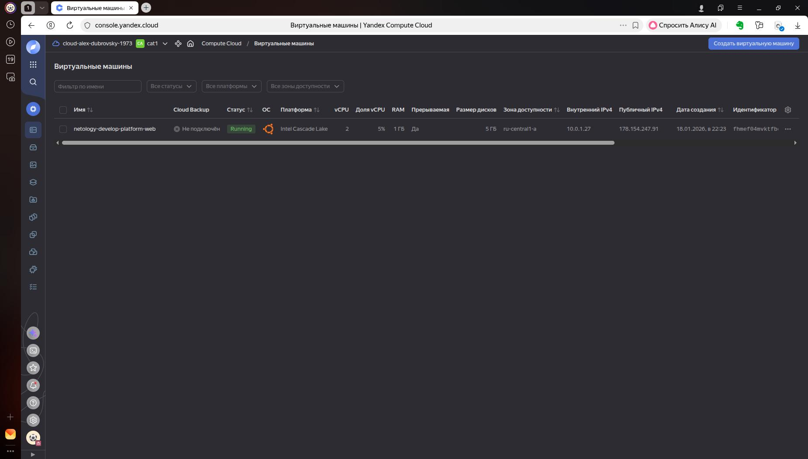
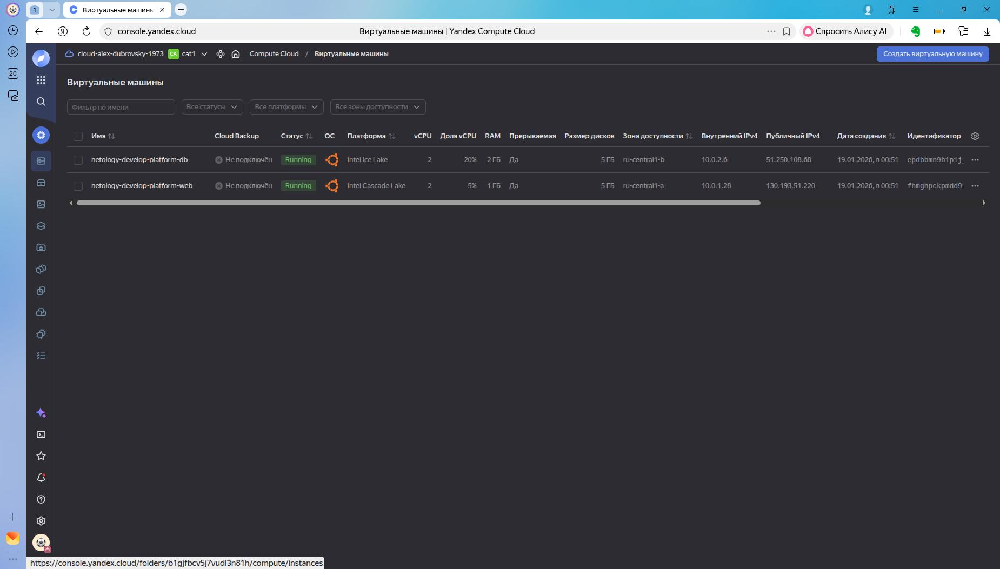

#### Task 1 ####  
Умышленно или нет в задании допущена ошибка в названии переменной vms_ssh_public_root_key, хотя на самом деле в коде используется переменная vms_ssh_root_key  
Была ошибка в названии платформы: для Intel Cascade Lake правильный platform_id - standard-v2  
Допустимое кол-во ядер (cores): 2,4  
Допустимая доля 5% именно для standard-v2,  если бы выбрал standard-v3, то следовало бы изменить и core_fraction = 20  

```
ubuntu@fhmef04mvktfbchce8mg:~$ curl ifconfig.me  
178.154.247.91  
```  
preemptible = true - означает, что машина прерываемая, машина автоматически будет отключаться  
core_fraction = 5 - 5% мощности ядра как базовый показатель предоставляемой мощности  
Параметры необходимы для экономии средств.  
#### Task 2 ####  
После замены статических значений переменными terraform plan показал что никаких изменений нет.  
#### Task 3 ####  
Для создания второй ВМ создал блок с ресурсом инстанции, в которой добавлен параметр zone/
Кроме того, для запуска ВМ в другой зоне создал переменные и ресурс - подсеть в зоне Б  с ip cidr 10.0.2.0/24

#### Task 4 ####  
```
Apply complete! Resources: 0 added, 0 changed, 0 destroyed.

Outputs:

output_db_fqdn = "epdbbmn9b1p1jjnfhm60.auto.internal"
output_db_ip = "51.250.108.68"
output_db_name = "netology-develop-platform-db"
output_web_fqdn = "fhmghpckpmdd915vq4ki.auto.internal"
output_web_ip = "130.193.51.220"
output_web_name = "netology-develop-platform-web"
```
#### Task 5 ####  
```
locals {
  vm_web_name = "task-5-${var.vm_web_name}"
  vm_web_cores = "${var.vm_web_cores}"
  vm_web_memory = "${var.vm_web_memory}"
  vm_web_fraction = "${var.vm_web_fraction}"
  vm_db_name = "task-5-${var.vm_db_name}"
  vm_db_cores = "${var.vm_db_cores}"
  vm_db_memory = "${var.vm_db_memory}"
  vm_db_fraction = "${var.vm_db_fraction}"
}
```
```
Outputs:

output_db_fqdn = "epdbf2q7pejhspjblfii.auto.internal"
output_db_ip = "89.169.173.54"
output_db_name = "task-5-netology-develop-platform-db"
output_web_fqdn = "fhmetrtncarccucaq5vk.auto.internal"
output_web_ip = "62.84.117.146"
output_web_name = "task-5-netology-develop-platform-web"
res = [
  {
    "cores" = 2
    "fraction" = 20
    "memory" = 4
  },
]
```

#### Task 6 ####
##### 6.1 #####
Добавил переменную в variables.tf  
```
variable "vms_resources" {
  type        = map
  default     = {
    web = {
      cores         = 2
      memory        = 2
      fraction = 5
    }
    db = {
      cores         = 2
      memory        = 4
      fraction = 20
    }
  }
}
```
Заменил источник данных для атрибутов ресурсов в main.tf  
```
  resources {
    cores         = var.vms_resources.db.cores
    memory        = var.vms_resources.db.memory
    core_fraction = var.vms_resources["db"].fraction
#    cores         = local.vm_db_cores
#    memory        = local.vm_db_memory
#    core_fraction = local.vm_db_fraction
  }
```
terraform apply после таких изменений в код не произвел никаких изменений в инфраструктуру  
##### 6.2 #####
Создал переменную, которая может использоваться не только с Ubuntu  
```
variable  "vms_md" {
  type       = map
  default    = {
    serial  = 1
    key     = "ssh-ed25519 AAAAC3NzaC1lZDI1NTE5AAAAIJl7ngD4lOf7xiZ2aQ5B9arkVXXwQ0mQ0VJizRWEnutr root@uxtu-note"
  }
}
```
В main.tf заменил хардкод значениями из map  
```
  metadata = {
    serial-port-enable = var.vms_md.serial
    ssh-keys           = "ubuntu:${var.vms_md.key}"
  }
```

